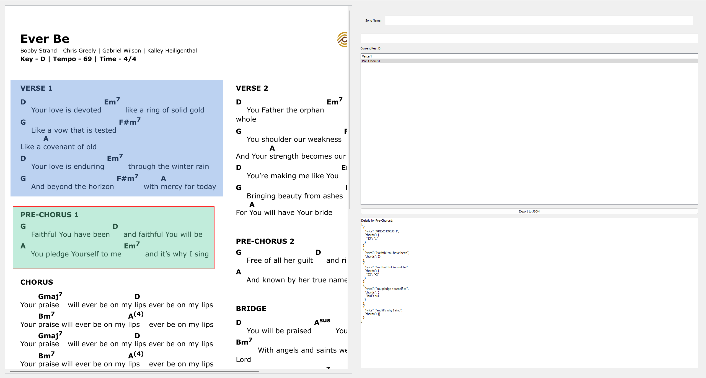

# SheetLabeler

Sheet Labeler ist ein PyQt5 programm, dass es ermöglicht json label in dem gebrauchten Format für P2PChords zu erstellen. 
Durch das auswählen von Sections und der analyse dieser durch OCR.

